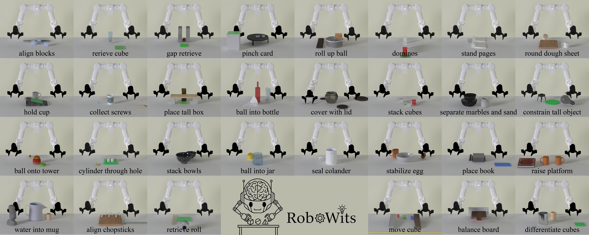

<p align="center">
  <h1 align="center">RoboWits: Unexpected Challenges for Robotic Creative Problem Solving</h1>
  <p align="center">
    arXiv 2026
  </p>
  <p align="center">
    <a href="https://chunru-lin.github.io/">Chunru Lin</a><sup>*</sup>,
    <a href="https://icefoxzhx.github.io/">Hongxin Zhang</a><sup>*</sup>,
    <a href="https://ario-photography.netlify.app/dist/about_me">Fenghao Yu</a>,
    <a href="https://acmlczh.github.io/">Zhehuan Chen</a>,
    <a href="https://cocosci.princeton.edu/tom/index.php">Thomas L. Griffiths</a>,
    <a href="https://yejinc.github.io/">Yejin Choi</a>,
    <a href="https://davheld.github.io/">David Held</a>,
    <a href="https://people.csail.mit.edu/ganchuang/">Chuang Gan</a>
  </p>
  <p align="center">
    <a href="https://arxiv.org/abs/2605.30326">
      
    </a>
    <a href='https://umass-embodied-agi.github.io/RoboWits/' style='padding-left: 0.5rem;'>
      
    </a>
    <a href='https://huggingface.co/datasets/XHRlyb2001/RoboWits_lerobot_dataset' style='padding-left: 0.5rem;'>
      
    </a>
  </p>
</p>

**RoboWits**, a bi-manual robotic benchmark designed to systematically evaluate cognitive reasoning, creative tool use, and robustness to unexpected conditions.

<p align="center">
    
</p>

<br>

<!-- TABLE OF CONTENTS -->
<details open="open" style='padding: 10px; border-radius:5px 30px 30px 5px; border-style: solid; border-width: 1px;'>
  <summary>Table of Contents</summary>
  <ol>
    <li>
      <a href="#news">News</a>
    </li>
    <li>
      <a href="#installation">Installation</a>
    </li>
    <li>
      <a href="#quick-start">Quick Start</a>
    </li>
    <li>
      <a href="#benchmark">Benchmark</a>
    <li>
      <a href="#acknowledgement">Acknowledgement</a>
    </li>
    <li>
      <a href="#citation">Citation</a>
    </li>
  </ol>
</details>

## News
- [2026-06-04] We release the Benchmark code, along with the [dataset](https://huggingface.co/datasets/XHRlyb2001/RoboWits_lerobot_dataset) consisting of ~50 demonstrations on 24 seed tasks for fine-tuning!
- [2026-05-30] RoboWits is on [arXiv](https://arxiv.org/abs/2605.30326)! Check out our [project website](https://umass-embodied-agi.github.io/RoboWits/) for videos.


## Installation

### Dependencies

Install [uv](https://docs.astral.sh/uv/getting-started/installation/) if you haven't already.

```bash
uv sync
source .venv/bin/activate
```

### Assets

Some assets come from [BlenderKit](https://www.blenderkit.com/) and require an API key to download, which can be found in your [profile](https://www.blenderkit.com/profile/addon/). Some BlenderKit assets are only available in `.blend` format — the download script converts them to GLB automatically by invoking Blender as a subprocess.

#### Install Blender

Make sure Blender is installed and available on your `PATH`:

```bash
# macOS (Homebrew)
brew install --cask blender

# Or download from https://www.blender.org/download/ and add to PATH
echo 'export PATH="/Applications/Blender.app/Contents/MacOS:$PATH"' >> ~/.zshrc && source ~/.zshrc

# Ubuntu (headless) — download the latest tarball from https://www.blender.org/download/
wget https://mirrors.dotsrc.org/blender/release/Blender5.1/blender-5.1.2-linux-x64.tar.xz
tar -xf blender-5.1.2-linux-x64.tar.xz -C /opt
echo 'export PATH="/opt/blender-5.1.2-linux-x64:$PATH"' >> ~/.bashrc && source ~/.bashrc

# Verify
blender --version
```

#### Prepare Assets

```bash
bash assets/setup_assets.sh --api-key <BLENDERKIT_API_KEY>
```

> **Note:** Some assets require a BlenderKit full-plan subscription. If your API key is a free-tier key, downloads for paid assets will be skipped automatically and those tasks will be unavailable.

The directory should look like:

```
assets/
  hf_assets/
    work_table.glb
    marvin_bimanual/
      ...
    worktable_texture/
      grained black plastic_Normal.jpg
      grained black plastic_Roughness.jpg
    ...
  blender_kit/
    <asset-id>/
      obj.glb
    ...
```

## Quick Start

### Run the environment

```bash
python scripts/robowits/examples/run_env.py 
```

### Available Tasks

```python
import gs_gym

# List all tasks
print(gs_gym.list_tasks())

# List tasks by benchmark
print(gs_gym.list_tasks(benchmark="robowits"))

# List all benchmarks
print(gs_gym.list_benchmarks())
```

### Observation Modes

Configure via `observation_mode` parameter:

| Mode | Dim | Contents |
|------|-----|----------|
| `"EE"` (default) | 14D | Right EE pos (3) + rot axis-angle (3) + left EE pos (3) + rot axis-angle (3) + grippers (2) |
| `"JOINT"` | 16D | Right joints (7) + right gripper (1) + left joints (7) + left gripper (1) |

### Control Modes

Configure via `control_mode` parameter:

| Mode | Dim | Description |
|------|-----|-------------|
| `"EE_ABS"` (default) | 14D | Absolute end-effector pose (IK handled internally) |
| `"EE_DELTA"` | 14D | Delta end-effector pose |
| `"JOINT_ABS"` | 16D | Absolute joint positions |
| `"JOINT_DELTA"` | 16D | Delta joint positions (gripper width is absolute) |

### Observation Format

**Environment output:**
- `"agent_pos"`: (n_envs, D) numpy array — robot state for the policy; D depends on `observation_mode`
- `"agent_pos_joint"`: (n_envs, 16) numpy array — JOINT state, always present regardless of `observation_mode`
- `"agent_pos_ee"`: (n_envs, 14) numpy array — EE state, always present regardless of `observation_mode`
- `"pixels"`: dict of (n_envs, H, W, 3) numpy uint8 arrays — camera images
  - `"ego"`: Static ego-view camera
  - `"wrist_right"`: Right wrist camera
  - `"wrist_left"`: Left wrist camera

**After `preprocess_observation()` + `add_envs_task()`** (LeRobot format):
- `"observation.state"`: torch.Tensor (n_envs, D) — policy input, mirrors `agent_pos`
- `"observation.agent_pos_joint"`: torch.Tensor (n_envs, 16) — always recorded
- `"observation.agent_pos_ee"`: torch.Tensor (n_envs, 14) — always recorded
- `"observation.images.ego"`: torch.Tensor (n_envs, 3, H, W) — channel-first, normalized [0, 1]
- `"observation.images.wrist_right"`: torch.Tensor (n_envs, 3, H, W)
- `"observation.images.wrist_left"`: torch.Tensor (n_envs, 3, H, W)
- `"task"`: list[str] (n_envs,) — natural language task description, added by lerobot-eval

### Training and Evaluation

RoboWits integrates with LeRobot via a local patched version in `third_party/lerobot/`. All scripts use `lerobot-train` / `lerobot-eval` and accept configuration via environment variables.

#### Training

A dataset containing ~50 human demonstrations for ~24 robowits seed tasks is available on HuggingFace at [`XHRlyb2001/RoboWits_lerobot_dataset`](https://huggingface.co/datasets/XHRlyb2001/RoboWits_lerobot_dataset). Here are some example training script with the dataset.

```bash
# ACT (env vars: HF_DATASET, OUTPUT_DIR, NUM_PROCESSES, STEPS, SAVE_FREQ, VAL_FREQ)
bash scripts/robowits/train/train_act.sh

# Pi0
bash scripts/robowits/train/train_pi0.sh

# Pi0.5
bash scripts/robowits/train/train_pi05.sh
```

All training scripts use `accelerate launch --multi_gpu` with W&B logging enabled by default. Checkpoints are saved to `checkpoints/<policy>_robowits/` by default.

#### Evaluation

```bash
# Evaluate on robowits-10 seed tasks (env vars: CHECKPOINT_PATH, TASK_IDS, CONFIG, OBSERVATION_MODE, N_EPISODES)
CHECKPOINT_PATH=/path/to/checkpoint TASK_IDS="01 02 03 04 06 09 13 16 17 25" bash scripts/robowits/eval/eval.sh

# Evaluate on mutation tasks
CHECKPOINT_PATH=/path/to/checkpoint TASK_IDS="01 02 03 04 06 09 13 16 17 25" bash scripts/robowits/eval/eval_mutation.sh
```

## Benchmark

RoboWits-10 is a subset of 10 representative tasks for standardized evaluation. Each policy is trained jointly on all tasks with 50 demonstrations per task.

| Task               |    ACT    |           |    Pi0    |           |   Pi0.5   |           |
|--------------------|:---------:|:---------:|:---------:|:---------:|:---------:|:---------:|
|                    |   Seed    |    Mut    |   Seed    |    Mut    |   Seed    |    Mut    |
| 01 Align Blocks    | 16%, 0.30 |  7%, 0.18 | 14%, 0.29 | 10%, 0.22 | 24%, 0.39 | 16%, 0.29 |
| 02 Retrieve Cube   |  2%, 0.02 |  0%, 0.00 |  0%, 0.00 |  0%, 0.00 |  2%, 0.02 |  4%, 0.04 |
| 03 Gap Retrieve    |  6%, 0.06 |  8%, 0.08 | 16%, 0.16 |  8%, 0.08 | 18%, 0.18 |  8%, 0.08 |
| 04 Pinch Card      |  2%, 0.60 |  0%, 0.51 |  0%, 0.60 |  0%, 0.52 |  0%, 0.52 |  0%, 0.47 |
| 06 Dominos         | 82%, 0.95 | 33%, 0.59 | 92%, 0.98 | 47%, 0.61 | 80%, 0.96 | 57%, 0.61 |
| 09 Hold Cup        |  0%, 0.48 |  0%, 0.43 |  0%, 0.56 |  0%, 0.41 |  2%, 0.53 |  8%, 0.41 |
| 13 Cover With Lid  |  0%, 0.50 |  0%, 0.43 |  0%, 0.56 |  0%, 0.44 |  0%, 0.57 |  0%, 0.43 |
| 16 Stand Bulb      |  2%, 0.54 |  0%, 0.12 |  0%, 0.56 |  0%, 0.12 |  0%, 0.57 |  0%, 0.12 |
| 17 Ball Onto Tower |  0%, 0.56 |  0%, 0.51 |  0%, 0.57 |  0%, 0.55 |  0%, 0.53 |  5%, 0.48 |
| 25 Water Into Mug  |  0%, 0.29 |  0%, 0.27 |  0%, 0.32 |  0%, 0.26 |  0%, 0.26 |  0%, 0.19 |
| **Average**        | **11.0%, 0.43** | **4.8%, 0.31** | **12.2%, 0.46** | **6.5%, 0.32** | **12.6%, 0.45** | **9.8%, 0.31** |

Format: success rate (%), progress score [0,1]. Seed/Mut = evaluated on seed episodes / mutation variants.

## Acknowledgement

Robowits is built upon amazing open-source projects:

- [Genesis World](https://github.com/Genesis-Embodied-AI/genesis-world) Provides the universal physics engine.
- [LeRobot](https://github.com/huggingface/lerobot)  Provides training and inference infrastructures.

## Citation

If you find our work useful, please consider citing:

```
@article{lin2026robowits,
  title={RoboWits: Unexpected Challenges for Robotic Creative Problem Solving},
  author={Lin, Chunru and Zhang, Hongxin and Yu, Fenghao and Chen, Zhehuan and Griffiths, Thomas L and Choi, Yejin and Held, David and Gan, Chuang},
  journal={arXiv preprint arXiv:2605.30326},
  year={2026}
}
```